This article shows how to setup and configure CI/CD platform [Jenkins](https://jenkins.io) on an Ubuntu Linux VM with the tools and plug-ins configured to work with Azure.

In this article, you'll learn how to:

> * Create a setup file that downloads and installs Jenkins
> * Create a resource group
> * Create a virtual machine with the setup file
> * Open port 8080 in order to access Jenkins on the virtual machine
> * Connect to the virtual machine via SSH
> * Install Docker and Kubernetes(K3s) cluster on VM
> * Configure a sample Jenkins job based on a sample NodeJS containerized app in GitHub
> * Build the sample Jenkins job
> * Publish the artifacts (docker image) into hub.docker.com
> * Deploye the artifacts on Kuberneties(K3s) Cluster.

Prerequsite:
> * Github account to fork the sample app(shark-info) from repo: https://github.com/HCL-Cloud-Native-Labs/sre-shark-info.git
> * Dockerhub account to push(store) artifacts(docker images) of sample app.
> * Valid azure account 

## 1. Create a virtual machine using Azure CLI

1. Login to Azure Portal and connect Cloud-Shell
1. Run [az account set](/cli/azure/subscription#"subscription-name") to set your subsciption.

   ```azurecli
   az account set --subscription "subscription-name"
   ```
   
1. Run [az group create](/cli/azure/group#az-group-create) to create a resource group.(SKIP THIS STEP as we created resource group for you.)

    ```azurecli
    az group create --name sre-cohort-20 --location eastus
    ```
1. Run [az vm create](/cli/azure/vm#az-vm-create) to create a virtual machine.

    ```azurecli
    az vm create \
    --resource-group sre-cohort-20 \
    --name your-vm-name \
    --image UbuntuLTS \
    --admin-username "azureuser" \
    --generate-ssh-keys \
    --public-ip-sku Standard
    ```
1. Run [az vm list](/cli/azure/vm#az-vm-list) to verify the creation (and state) of the new virtual machine.

    ```azurecli
    az vm list -d -o table --query "[?name=='your-vm-name']"
    ```
    
1. Run [az vm show](/cli/azure/vm#az-vm-show) to get the public IP address for the sample virtual machine.

    ```azurecli
    az vm show \
    --resource-group sre-cohort-20 \
    --name your-vm-name -d \
    --query [publicIps] \
    --output tsv
    ```
    
    **Key points**:

    - The `--query` parameter limits the output to the public IP addresses for the virtual machine.
    
1. Using the IP address retrieved in the previous step, SSH into the virtual machine. You'll need to confirm the connection request.

    ```azurecli
    ssh azureuser@<ip_address>
    ```

    **Key points**:

    - Upon successful connection, the Cloud Shell prompt includes the user name and virtual machine name: `azureuser@your-vm-name`.
    
1. Run the following commands on vm to install Jenkins:

    ```
      sudo apt install openjdk-11-jre -y
      wget -qO - https://pkg.jenkins.io/debian-stable/jenkins.io.key | sudo apt-key add -
      sh -c 'echo deb https://pkg.jenkins.io/debian-stable binary/ > /etc/apt/sources.list.d/jenkins.list'
      sudo apt-get update && sudo apt-get install jenkins -y
      sudo service jenkins restart
    ```    
 
 1. Verify that Jenkins is running by getting the status of the Jenkins service.

    ```bash
    service jenkins status
    ```

    **Key points**:

    - If you receive an error regarding the service not existing, you may have to wait a couple of minutes for everything to install and initialize.

1. Get the autogenerated Jenkins password.

    ```bash
    sudo cat /var/lib/jenkins/secrets/initialAdminPassword
    ```

## 2. Install Docker and Kubernetes(k3s) on VM

1. Run the following commands to install docker engine using root user
   ```azurecli
   sudo apt  install docker.io
   sudo usermod -a -G docker jenkins
   sudo chmod 666 /var/run/docker.sock
   ```

1. Run the following commands to install Kubernetes(K3s) using root user
   ```azurecli
   curl -sfL https://get.k3s.io | sh - --write-kubeconfig-mode 644
   systemctl status k3s.service
   kubectl cluster-info
   
   ```

## 3. Configure Jenkins

1. As Jenkins runs on port 8080, run [az vm open](/cli/azure/vm#az-vm-open-port) on Cloud-Shell to open port 8080 on the new virtual machine.

    ```azurecli
    az vm open-port \
    --resource-group sre-cohort-20 \
    --name my-vm-name  \
    --port 8080 --priority 1010
    ```
    
1. Using the IP address, open the following URL in a browser: `http://<ip_address>:8080`

1. Enter the password you retrieved earlier and select **Continue**.

   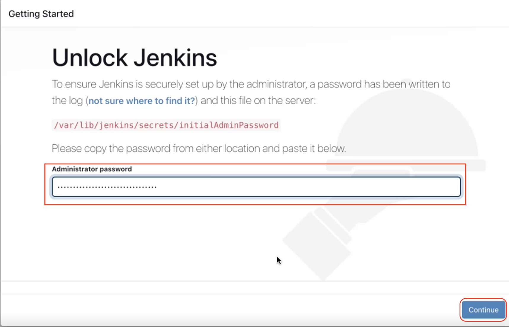
   

1. Select **Select plug-in to install**.

    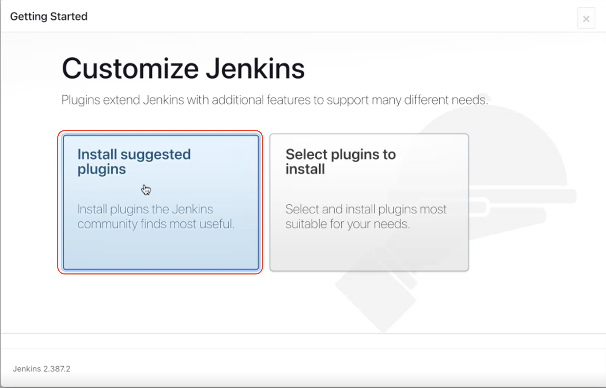

1. Enter the information for the first admin user and select **Save and Continue**.

    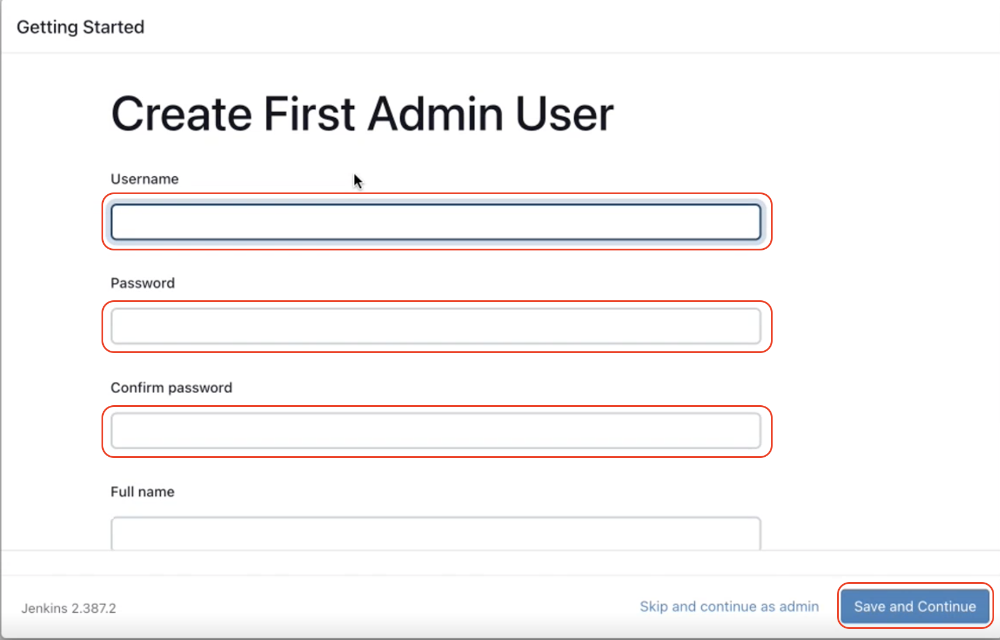

1. On the **Instance Configuration** page, select **Save and Finish**.

    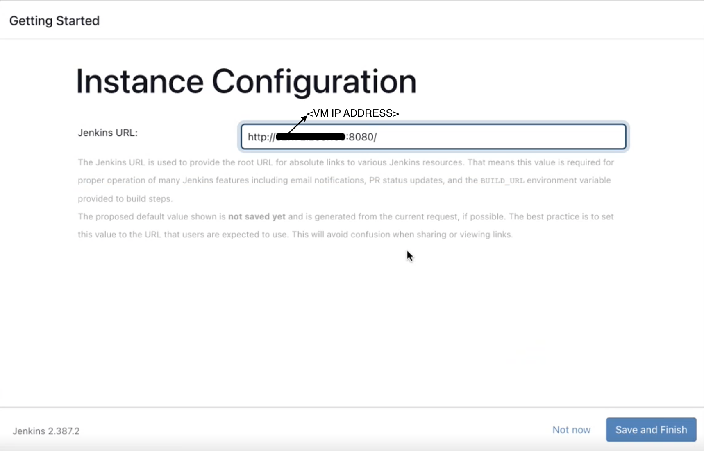

1. Select **Start using Jenkins**.

    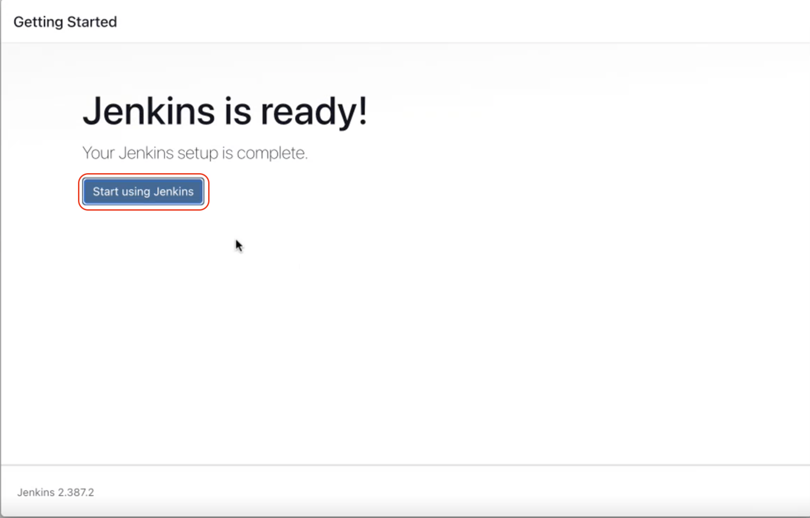

1. Fork the sample app from repo: https://github.com/HCL-Cloud-Native-Labs/sre-shark-info.git
   
   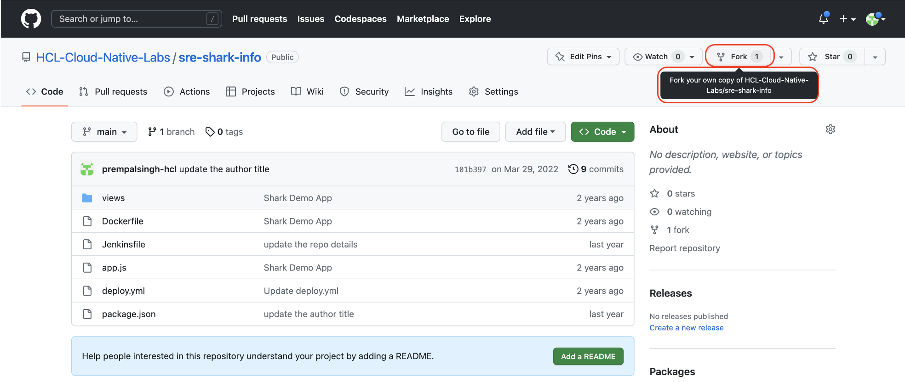
   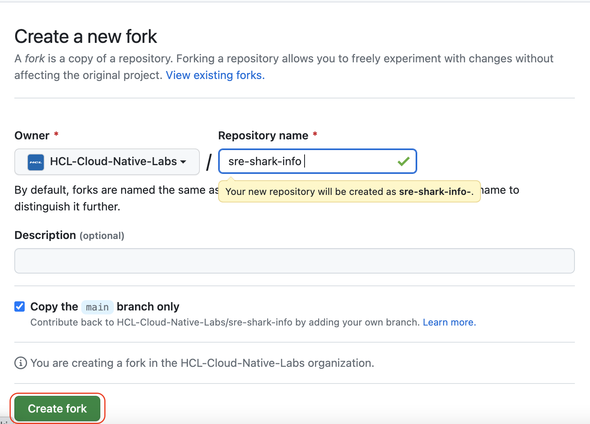

1. On the Jenkins home page, select **Create a job**.

    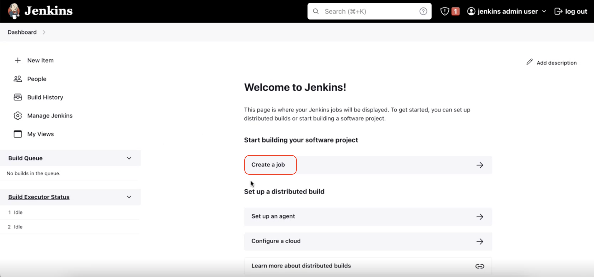

1. Enter a job name of `Declarative-Job`, select **Pipeline project**, and select **OK**.

    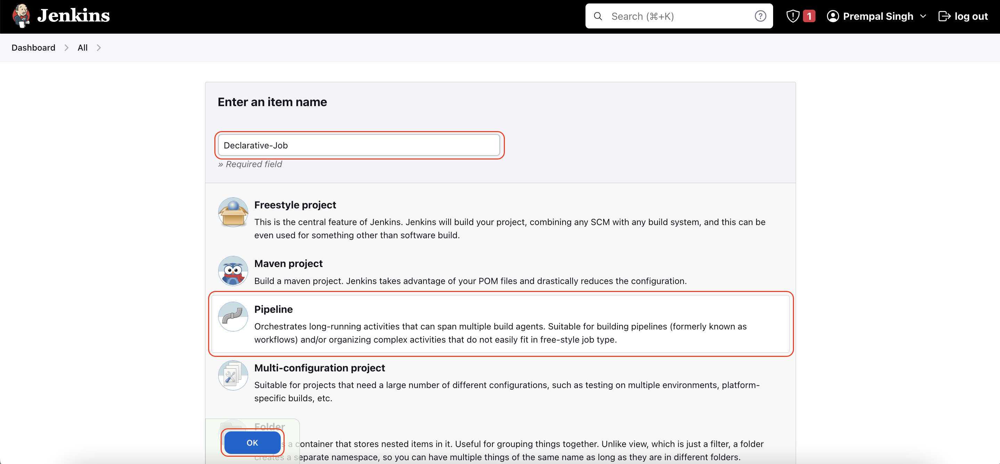

1. Go to **Pipeline Section** select the **Pipeline Script from SCM** from Defination tab. Choose **Git** from SCM tab and enter the following URL for the **Repository URL** value: `https://github.com/<github-account-name>/sre-shark-info.git`. Then change the **Branch Specifier** to `*/main`.

    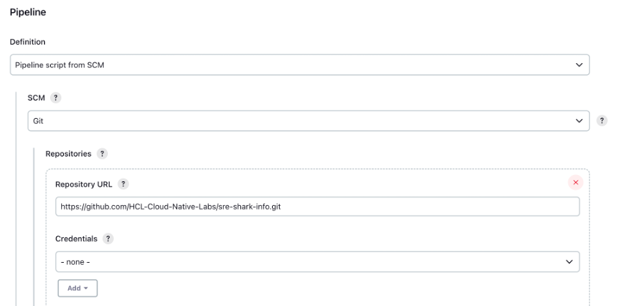
    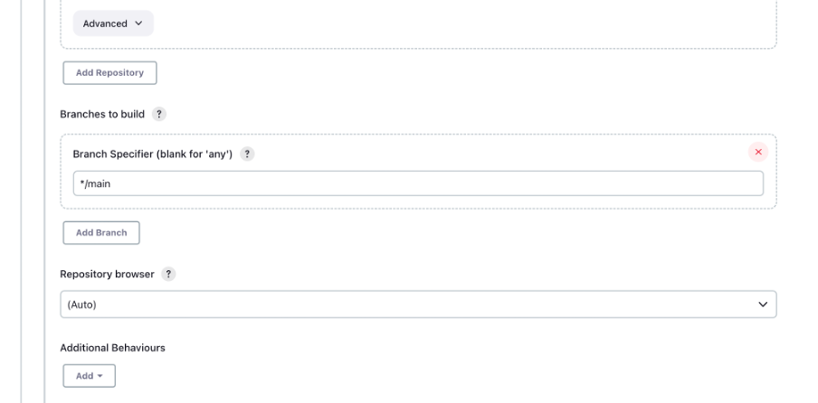
    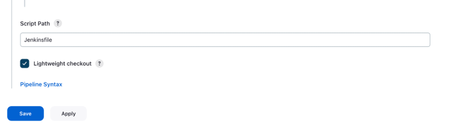
    
   **Key points**:

    - Fork the sample app repository for **Repository URL** value: 


1. Write " Jenkinsfile" in Script Path tab.

1. Scroll to the bottom of the page, and select **Save**.

## 3. Build the sample application - Shark-info

1. When the home page for your project displays, select **Build Now** to compile the code and package the sample app.

    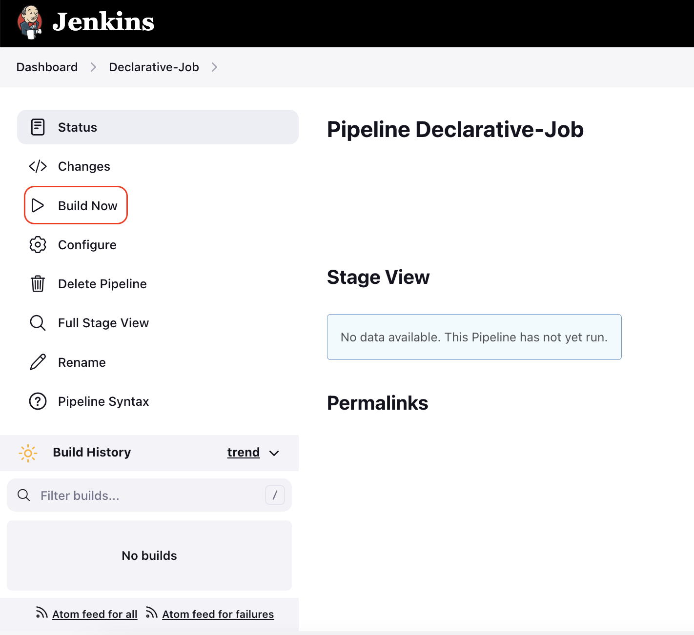

1. A graphic below the **Build History** heading indicates that the job is being built.

    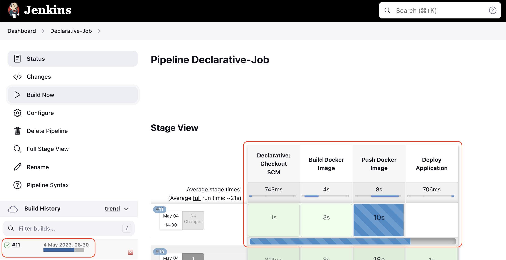
    
1. As Shark-Info runs on port 31113, run [az vm open](/cli/azure/vm#az-vm-open-port) on Cloud-Shell to open port 31113 on the new virtual machine.

    ```azurecli
    az vm open-port \
    --resource-group sre-cohort-20 \
    --name my-vm-name  \
    --port 31113 --priority 1020
    ```
1. Using the VM IP address, open the following URL in a browser: `http://<vm ip_address>:31113`

1. Your Jenkins server is now ready to build your own projects in Azure!
